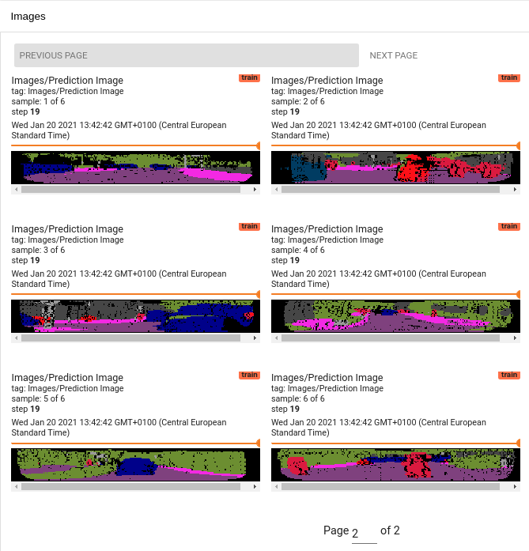
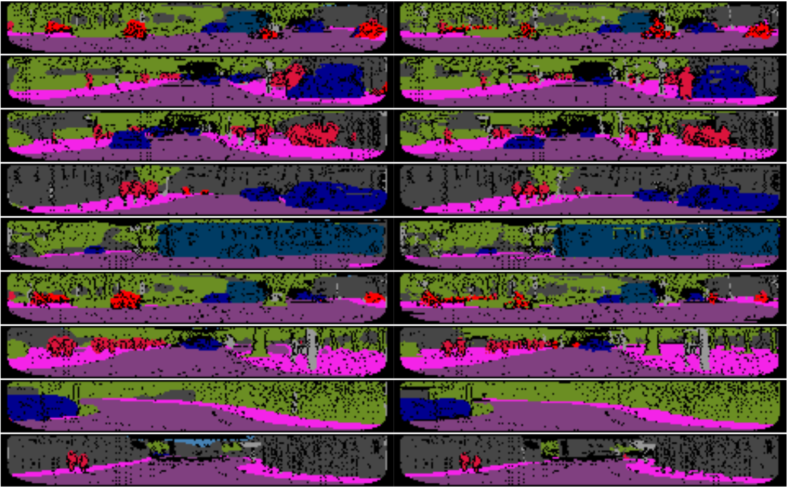

## Semantic Segmentation of LiDAR Point Clouds in Tensorflow 2.9.1 with SqueezeSeg


This repository contains implementations of SqueezeSegV2 [1], Darknet53 [2] and Darknet21 [2] for semantic point cloud
segmentation implemented in Keras/Tensorflow 2.9.1 The repository contains the model architectures, training, evaluation and
visualisation scripts. We also provide scripts to load and train the public dataset
[Semantic Kitti](http://www.semantic-kitti.org/) and [NuScenes](https://www.nuscenes.org/).

## Usage

#### Installation
All required libraries are listed in the `requirements.txt` file. You may install them within a 
[virtual environment](https://packaging.python.org/guides/installing-using-pip-and-virtual-environments/#creating-a-virtual-environment)
with:
```bash
pip install -r requirements.txt
```

#### Data Format
This repository relies on the data format as in [1]. A dataset has the following file structure:
```
.
├── train
├── val
├── test
```
The data samples are located in the directories `train`, `val` and `test`.
 
 A data sample is stored as a numpy `*.npy` file. Each file contains
a tensor of size `height X width X 6`. The 6 channels correspond to

0. X-Coordinate in [m]
1. Y-Coordinate in [m]
2. Z-Coordinate in [m]
3. Intensity (with range [0-255])
4. Depth in [m]
5. Label ID

For points in the point cloud that are not present (e.g. due to no reflection), the depth will be zero.
A sample dataset can be found in the directory `data`.

#### Sample Dataset
This repository provides several sample dataset which can be used as a template for your own dataset. The directory 
`dataset_samples` contains the directories
```
.
├── nuscenes
├── sample_dataset
├── semantic_kitti
```
Each directory in turn contains a `train` and `val` split with 32 train samples and 3 validation samples.

#### Data Normalization
For a proper data normalization it is necessary to iterate over training set and determine the __mean__ and __std__
values for each of the input fields. The script `preprocessing/inspect_training_data.py` provides such a computation.

```bash
# pclsegmentation/pcl_segmentation
$ python3 preprocessing/inspect_training_data.py \
--input_dir="../dataset_samples/sample_dataset/train/" \
--output_dir="../dataset_samples/sample_dataset/ImageSet"
```
The glob pattern `*.npy` is applied to the `input_dir` path. The script computes and prints the mean and std values
for the five input fields. These values should be set in the configuration files in
[pcl_segmentation/configs](pcl_segmentation/configs) as the arrays `mc.INPUT_MEAN` and `mc.INPUT_STD`.

#### Training
The training of the segmentation networks can be evoked by using the `train.py` script. It is possible to choose between
three different network architectures: `squeezesegv2` [1],  `darknet21` [2] and `darknet53` [2].
The training script uses the dataset splits `train` and `val`. The metrics for both splits are constantly computed
during training. The Tensorboard callback also uses the `val` split for visualisation of the current model prediction.
```bash
# pclsegmentation/pcl_segmentation
$ python3 train.py \
--data_path="../sample_dataset" \
--train_dir="../output" \
--epochs=5 \
--model=squeezesegv2
```

#### Evaluation
For the evaluation the script `eval.py` can be used.
Note that for the evaluation the flag `--image_set` can be set to `val` or `test` according to datasets which are present
at the `data_path`.
```bash
# pclsegmentation/pcl_segmentation
$ python3 eval.py \
--data_path="../sample_dataset" \
--image_set="val" \
--eval_dir="../eval" \
--path_to_model="../output/model" \
--model=squeezesegv2
```

#### Inference
Inference of the model can be performed by loading some data samples and by loading the trained model. The script 
includes visualisation methods for the segmented images. The results can be stored by providing 
`--output_dir` to the script.
```bash
# pclsegmentation/pcl_segmentation
$ python3 inference.py \
--input_path="../sample_dataset/train/*.npy" \
--output_dir="../output/prediction" \
--path_to_model="../output/model" \
--model=squeezesegv2
```

## Docker
We also provide a docker environment for __training__, __evaluation__ and __inference__. All script can be found in the 
directory `docker`.

First, build the environment with 
```bash
# docker
./docker_build.sh
```

Then you can execute the sample training with
```bash
# docker
./docker_train.sh
```

and you could evaluate the trained model with
```bash
# docker
./docker_eval.sh
```

For inference on the sample dataset execute:
```bash
# docker
./docker_inference.sh
```

## Datasets
In the directory [dataset_convert](dataset_convert) you will find conversion scripts to convert following datasets
to a format that can be read by the data pipeline implemented in this repository.

### NuScenes
Make sure that you have installed `nuscenes-devkit` and that you downloaded the nuScenes dataset correctly. Then execute
the script `nu_dataset.py`
```bash
# dataset_convert
$ python3 nu_dataset.py \
--dataset /root/path/nuscenes \
--output_dir /root/path/nuscenes/converted
```
The script will generate `*.npy` files into the directory `converted`. It will automatically create a train/val split.
Make sure to create two empty directories `train` and `val`. The current implementation will perform a class reduction. 


### Semantic Kitti
The [Semantic Kitti](http://www.semantic-kitti.org/) dataset can be converted with the script `semantic_kitti.py`.
```bash
# dataset_convert
$ python3 semantic_kitti.py \
--dataset /root/path/semantic_kitti \
--output_dir /root/path/semantic_kitti/converted
```
The script will generate `*.npy` files into the directory `converted`. It will automatically create a train/val split.
Make sure to create two empty directories `train` and `val`. The current implementation will perform a class reduction. 

### Generic PCD dataset
The script [`pcd_dataset.py`](dataset_convert/pcd_dataset.py) allows the conversion of a labeled `*.pcd` dataset. 
As input dataset define the directory that contains all `*.pcd` files. The pcd files need to have the field `label`.
Check the script for more details.

```bash
# dataset_convert
$ python3 pcd_dataset.py \
--dataset /root/path/pcd_dataset \
--output_dir /root/path/pcd_dataset/converted
```

## Tensorboard
The implementation also contains a Tensorboard callback which visualizes the most important metrics such as the __confusion
matrix__, __IoUs__, __MIoU__, __Recalls__, __Precisions__, __Learning Rates__, different __losses__ and the current model
__prediction__ on a data sample. The callbacks are evoked by Keras' `model.fit()` function.

```bash
# pclsegmentation
$ tensorboard --logdir ../output
```





## More Inference Examples

Left image: Prediction - Right Image: Ground Truth


## References
The network architectures are based on 
- [1] [SqueezeSegV2: Improved Model Structure and Unsupervised Domain Adaptation for Road-Object Segmentation from a 
LiDAR Point Cloud](https://github.com/xuanyuzhou98/SqueezeSegV2)
- [2] [RangeNet++: Fast and Accurate LiDAR Semantic Segmentation](https://github.com/PRBonn/lidar-bonnetal)
- [3] [Semantic Kitti](http://www.semantic-kitti.org/)
- [4] [nuScenes](https://www.nuscenes.org/)

### TODO
- [x] Faster input pipeline using TFRecords preprocessing
- [x] Docker support
- [ ] Implement CRF Postprocessing for SqueezeSegV2
- [x] Implement dataloader for Semantic Kitti dataset
- [x] Implement dataloader for nuScenes dataset
- [ ] None class handling
- [ ] Add results for Semantic Kitti and nuScenes 
- [x] Update to Tensorflow 2.9

### Author of this Repository
[Till Beemelmanns](https://github.com/TillBeemelmanns)

Mail: `till.beemelmanns (at) ika.rwth-aachen.de`